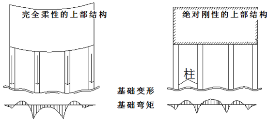

# 上部刚度与深梁

上部刚度：YJK-F软件将上部结构刚度与荷载凝聚到与下部基础相连的节点上，在基础计算时只要叠加上部结构凝聚刚度和荷载向量，其计算结果对于下部基础而言就是上下部结构共同作用计算的理论解。

如果勾选此项，则事先必须在上部结构计算时的计算参数中勾选“生成传给基础的刚度”，并输入传给基础刚度的楼层数。YJK-F既可以考虑上部全部楼层的刚度，也可以仅考虑用户输入的部分楼层的刚度，一般可以考虑上部结构的 2~3 层刚度足够了。

当结构由完全柔性->弹性地基梁->考虑上部刚度弹性地基梁-> 绝对刚性变化过程中，结论：基础变形差逐渐减小，桩反力逐渐均匀，内力配筋逐渐减小。

比较好题目：上海51层桩筏（荷载比较均匀）

|   | 绝对刚性 | 考虑上部刚度 | 不考虑上部刚度 | 完全柔性 |
|:-:|--:|--:|--:|--:|
||倒楼盖|弹性地基梁(桩刚10w)|弹性地基梁(桩刚10w)|弹性地基梁(桩刚1w)|
|位移差|0.4|32|59|183|
|桩反力差|880|3233|5544|3110|
|负Mx|-4800|-4700|-7000|-6380|
|正Mx|7700|10730|9050|16500|

板上剪力墙计算方案：选择刚性约束时，剪力墙等同于无限高度的深梁，墙下节点只发生刚体平动和旋转；深梁时按照有限高度的弹性梁计算，一般可以考虑上部结构的2~3层刚度，所以深梁高度近似按照5米考虑。

简而言之：

考虑上部刚度——上部结构刚度与荷载凝聚到与下部基础相连的节点上；

剪力墙深梁————按照有限高度的弹性梁计算剪力墙，二者最好配合使用。

*上部刚度文件对应当前的工作路径KF.DAT。*
