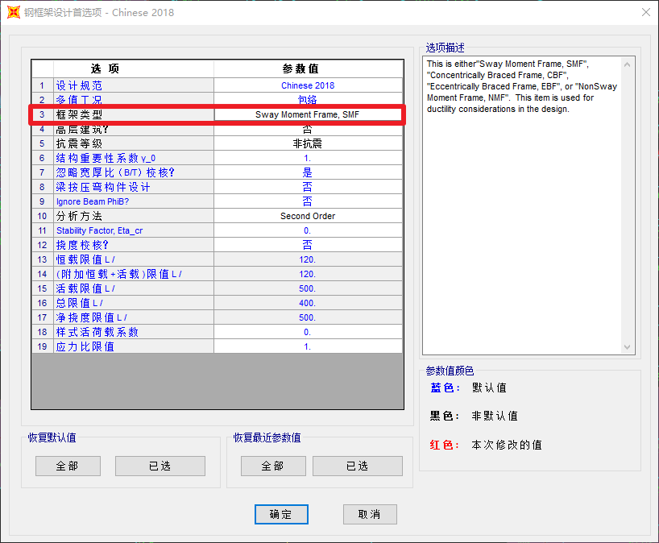

# SAP2000框架类型

"Sway Moment Frame, SMF"： 有侧移框架 

"Concentrically Braced Frame, CBF"： 中心支撑框架 

"Eccentrically Braced Frame, EBF"： 偏心支撑框架 

"NonSway Moment Frame, NMF"： 无侧移框架 

This item is used for ductility considerations in the design.(该项用于控制设计中的延性控制)

sway  [sweɪ]
n.影响；摇摆；摆动；统治
v.摇动；说服；使相信；使动摇
网络倾斜；摇晃；支配
